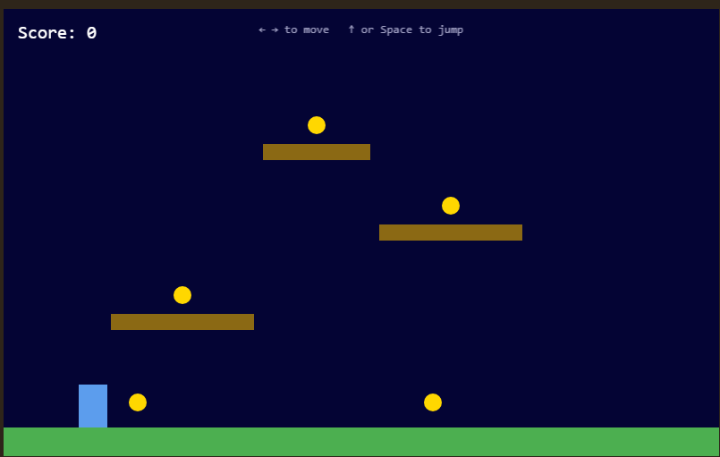
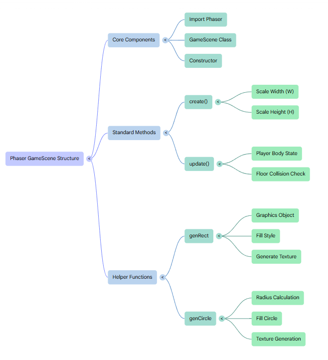
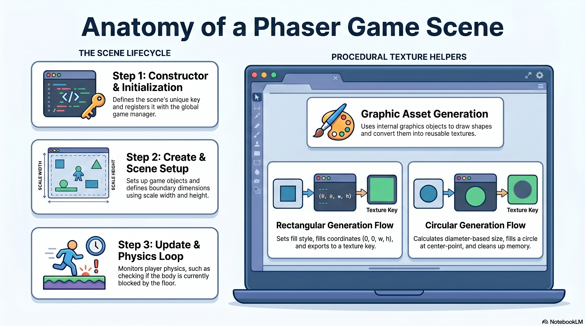

# Getting Started with Phaser



---

## The Phaser Library

### What Phaser Is

Phaser is an open-source HTML5 game framework for building 2D games that run in the browser. It handles everything a game needs below the level of your own logic: rendering, physics, input, audio, asset loading, animation, cameras, tilemaps, and the game loop itself. You write the game rules; Phaser handles the machinery.

Phaser renders to an HTML `<canvas>` element using either **WebGL** (GPU-accelerated, default when available) or **Canvas 2D** (CPU-based fallback). On modern hardware, WebGL enables thousands of sprites at 60 fps with effects like lighting, shaders, and post-processing that would be impossible in Canvas 2D.

### What Kinds of Games You Can Build

Phaser is a general-purpose 2D game framework. It has been used to build:

| Genre | Examples |
|-------|---------|
| **Platformers** | Side-scrolling jumpers, Metroidvanias |
| **Top-down games** | RPGs, twin-stick shooters, Zelda-style adventures |
| **Puzzle games** | Match-3, block puzzles, physics puzzlers |
| **Shoot-em-ups** | Vertical and horizontal bullet-hell games |
| **Idle / clicker games** | Resource management, incremental games |
| **Card games** | Turn-based games with drag-and-drop mechanics |
| **Tilemapped worlds** | Large scrolling maps built from reusable tile grids |
| **Visual novels** | Dialogue trees, cutscenes, branching narratives |

What Phaser is *not* suited for: 3D games (use Three.js or Babylon.js), very large MMOs, or applications that are more app than game. It is purpose-built for 2D interactive experiences delivered in the browser.

### Phaser's Major Subsystems

Phaser is organized into subsystems — each one responsible for a different aspect of the game. You access them through the scene as `this.<system>`. Here are the ones most relevant to a platformer:

#### The Scene System

A **Scene** is the fundamental unit of organization in Phaser. Every screen in your game — the title screen, the game level, the pause menu, the game-over screen — is a separate scene.

Each scene has three lifecycle methods you override:

```javascript
preload()  // load assets (images, audio, tilemaps) before the scene runs
create()   // set up game objects once when the scene starts
update()   // called every frame (~60 times/second) — game logic goes here
```

Our game currently has one scene (`GameScene`). In a larger game you might have:

```
BootScene      → loads a loading bar graphic
PreloadScene   → loads all game assets while showing the loading bar
MenuScene      → title screen with Play button
GameScene      → the actual level
PauseScene     → overlay rendered on top of GameScene
GameOverScene  → shown when the player dies
```

Scenes can run simultaneously (e.g. a HUD scene layered over the game scene), be paused, resumed, put to sleep, or shut down entirely. The scene manager (`this.scene`) controls all of this.

#### Physics — Arcade

`this.physics` is the arcade physics system. It gives game objects a **body** — a rectangle or circle that participates in the physics simulation each frame.

There are two kinds of physics bodies:

- **Dynamic** — affected by gravity, velocity, and collisions. The player is dynamic.
- **Static** — fixed in place, immovable. Platforms and the ground are static.

Key arcade physics concepts used in the platformer:

```javascript
// Create a dynamic physics sprite
this.player = this.physics.add.sprite(x, y, 'key');

// Create a static group (platforms)
this.platforms = this.physics.add.staticGroup();

// Prevent the player from leaving the canvas
this.player.setCollideWorldBounds(true);

// Make player land on platforms
this.physics.add.collider(this.player, this.platforms);

// Detect when player touches a coin (no solid collision — just detection)
this.physics.add.overlap(this.player, this.coins, callback);

// Read velocity and blocked state in update()
this.player.body.setVelocityX(-220);
this.player.body.setVelocityY(-550);  // jump
this.player.body.blocked.down;        // true when standing on something
```

The difference between **collider** and **overlap** is important:

- `collider` — objects physically push each other apart (player lands on a platform)
- `overlap` — detects contact without any physical response (player touches a coin)

#### Game Objects

Everything visible in the scene is a **game object**. The main types:

| Type | Created via | Use case |
|------|-------------|----------|
| `Sprite` | `this.physics.add.sprite()` | Animated characters, enemies |
| `Image` | `this.physics.add.staticImage()` | Non-animated objects (ground) |
| `Text` | `this.add.text()` | Score display, labels, UI |
| `Graphics` | `this.make.graphics()` | Drawing shapes procedurally |
| `Group` | `this.physics.add.staticGroup()` | Managing collections of objects |
| `TilemapLayer` | `map.createLayer()` | Tile-based level geometry |

In our game, all textures are generated procedurally via `this.make.graphics()` so no image files are needed. This is the `genRect()` and `genCircle()` helper approach in `GameScene.js`.

#### Input

`this.input` manages all input devices. For a platformer, keyboard input is the main concern:

```javascript
// Arrow keys + Space (built-in shortcut)
this.cursors = this.input.keyboard.createCursorKeys();

// Custom keys (WASD)
this.wasd = this.input.keyboard.addKeys({
  left:  Phaser.Input.Keyboard.KeyCodes.A,
  right: Phaser.Input.Keyboard.KeyCodes.D,
  jump:  Phaser.Input.Keyboard.KeyCodes.W
});
```

Two ways to read a key:

- **`key.isDown`** — `true` on every frame the key is held. Use for continuous actions like moving left/right.
- **`Phaser.Input.Keyboard.JustDown(key)`** — `true` only on the single frame the key is first pressed. Use for one-shot actions like jumping (prevents holding the jump key from triggering multiple jumps).

#### The Camera

`this.cameras.main` is the default camera. For a small fixed-screen game like ours, the camera never moves. But in a scrolling platformer, you bind it to follow the player:

```javascript
this.cameras.main.startFollow(this.player);
this.cameras.main.setBounds(0, 0, worldWidth, worldHeight);
```

The camera crops and offsets what is drawn each frame, allowing a world much larger than the canvas.

#### Asset Loading

`preload()` is where you load external assets before the scene runs. Phaser queues all load calls and shows a built-in loading bar, then fires `create()` only after everything is ready:

```javascript
preload() {
  this.load.image('sky', 'assets/sky.png');
  this.load.spritesheet('player', 'assets/dude.png', {
    frameWidth: 32, frameHeight: 48
  });
  this.load.audio('jump', 'assets/jump.mp3');
  this.load.tilemapTiledJSON('map', 'assets/level1.json');
}
```

Our current game skips `preload()` entirely because all textures are generated programmatically. This is useful for prototyping — no asset pipeline needed.

#### Animations

`this.anims` manages sprite animations. An animation is a sequence of frames from a spritesheet played at a given frame rate:

```javascript
// Define once in create()
this.anims.create({
  key: 'run',
  frames: this.anims.generateFrameNumbers('player', { start: 0, end: 3 }),
  frameRate: 12,
  repeat: -1       // -1 = loop forever
});

// Play it on a sprite
this.player.play('run');
this.player.play('idle');
```

Our current game has no animations because the player is a plain rectangle. Adding a spritesheet and animations is the natural next step.

#### Audio

`this.sound` plays audio files loaded in `preload()`:

```javascript
// One-shot sound effect
this.sound.play('jump');

// Looping background music
this.bgMusic = this.sound.add('music', { loop: true, volume: 0.5 });
this.bgMusic.play();
```

#### Quiz: Phaser Subsystems

**Which of the following is handled by `this.input`, NOT by `this.physics`?**

<div class="quiz-choices">
<input type="radio" id="qSubsystems_a" name="qSubsystems" value="wrong1">
<label for="qSubsystems_a">Resolving collisions between the player and platforms</label><br>
<input type="radio" id="qSubsystems_b" name="qSubsystems" value="wrong2">
<label for="qSubsystems_b">Applying gravity to dynamic bodies</label><br>
<input type="radio" id="qSubsystems_c" name="qSubsystems" value="correct">
<label for="qSubsystems_c">Reading which keyboard keys are currently pressed</label><br>
<input type="radio" id="qSubsystems_d" name="qSubsystems" value="wrong3">
<label for="qSubsystems_d">Detecting overlap between the player and coins</label><br>
<button class="check-btn" onclick="checkQuiz('qSubsystems')">Check Answer</button>
<div id="qSubsystems_feedback" class="quiz-feedback"></div>
</div>

### How Phaser Is Structured as a Package

When you run `npm install`, Phaser is downloaded into `node_modules/phaser/`. The library is one large bundle that includes all its subsystems. You import it in `main.js` as:

```javascript
import * as Phaser from 'phaser';
```

Vite then performs **tree-shaking** at build time — it analyzes which parts of Phaser your code actually uses and strips out the rest. This keeps the final `dist/` bundle smaller than the full library.

The `^4.0.0` version in `package.json` means Phaser 4, which was released in 2024. Phaser 4 is a significant rewrite of Phaser 3, with a new renderer architecture and updated APIs. Most online tutorials and documentation target Phaser 3; be aware of version differences when reading external resources.

---

## The Local Development Workflow

Because we use Vite's dev server (`npm run dev`), there is no build step during development:

1. Edit any file in VS Code and save
2. Reload the browser tab
3. Changes are live immediately

Vite serves your files directly from disk in dev mode — there is no `dist/` folder until you run `npm run build`. The `dist/` folder only exists for deployment.

::: {.callout-tip}
## npm run dev vs npm run build

| Command | What it does | When to use |
|---------|-------------|-------------|
| `npm run dev` | Starts a local dev server (e.g. `localhost:5174`). No output folder. Hot-reload friendly. | During development |
| `npm run build` | Bundles and minifies everything into `dist/`. No server. | Before deploying |
:::

---

## Project Structure and Bootstrapping Phaser

Every Phaser project built with Vite has the same three core files. Understanding what each one does — and how they connect — is the foundation for everything that follows.

```
phaser/
├── index.html      ← shell page loaded by the browser
├── src/
│   ├── main.js     ← configures and starts the Phaser engine
│   └── GameScene.js ← all game logic lives here
└── package.json    ← Vite + Phaser dependencies
```

### index.html — The Shell

```html
<!DOCTYPE html>
<html lang="en">
<head>
  <meta charset="UTF-8" />
  <title>Phaser Starter</title>
  <style>
    * { margin: 0; padding: 0; box-sizing: border-box; }
    body { background: #2e251a; display: flex; justify-content: center;
           align-items: center; height: 100vh; }
  </style>
</head>
<body>
  <script type="module" src="/src/main.js"></script>
</body>
</html>
```

`index.html` is nearly empty by design. Its only real job is this one line:

```html
<script type="module" src="/src/main.js"></script>
```

This tells the browser to load `main.js` as a JavaScript module, which kicks off the entire game. The CSS centers the canvas and sets the page background color so the game sits flush in the middle of the screen.

::: {.callout-note}
`type="module"` is required here because `main.js` uses ES module `import` syntax. Without it, the browser would throw a syntax error on the `import` statement.
:::

### main.js — Configuring and Starting Phaser

```javascript
import * as Phaser from 'phaser';
import GameScene from './GameScene.js';

const config = {
  type: Phaser.AUTO,
  width: 800,
  height: 500,
  backgroundColor: '#2d2d44',
  physics: {
    default: 'arcade',
    arcade: { gravity: { y: 600 }, debug: false }
  },
  scene: [GameScene]
};

new Phaser.Game(config);
```

`config` is a plain JavaScript object that describes how the game should be set up. It is passed directly to `new Phaser.Game()`.

| Key | Value | What it does |
|-----|-------|--------------|
| `type` | `Phaser.AUTO` | Let Phaser choose WebGL or Canvas based on what the browser supports. You can force one with `Phaser.WEBGL` or `Phaser.CANVAS`. |
| `width` / `height` | `800` / `500` | Canvas size in pixels. |
| `backgroundColor` | `'#2d2d44'` | Color painted behind all game objects. |
| `physics.default` | `'arcade'` | Which physics engine to use. |
| `physics.arcade.gravity.y` | `600` | Downward gravitational pull in units per second². Higher = heavier feel. |
| `physics.arcade.debug` | `false` | When `true`, draws collision boxes over every physics body. Useful during development. |
| `scene` | `[GameScene]` | The list of scenes to register. The first scene starts automatically. |

Phaser ships with two physics engines:

- **`arcade`** — Simple, fast, axis-aligned rectangles and circles. Ideal for most 2D games. Does not support rotation-based collisions.
- **`matter`** — Full rigid-body physics via Matter.js. Supports rotation, complex polygon shapes, joints, and constraints. More realistic but computationally heavier.

**`new Phaser.Game(config)`** is what actually starts the game. When called, Phaser:

1. Creates the `<canvas>` element and injects it into the DOM
2. Initializes the renderer (WebGL or Canvas per `type`)
3. Sets up the physics engine
4. Starts the game loop (the update/render cycle that runs every frame)
5. Launches the first scene in the `scene` array — in this case, `GameScene`

Without it, `config` is just an inert object in memory.

#### Quiz: What `new Phaser.Game(config)` does

**Before `new Phaser.Game(config)` runs, `config` is just a plain object sitting in memory. What does calling `new Phaser.Game(config)` actually cause to happen?**

<div class="quiz-choices">
<input type="radio" id="qNewGame_a" name="qNewGame" value="wrong1">
<label for="qNewGame_a">It parses the config object and prints it to the console — nothing visible happens on screen.</label><br>
<input type="radio" id="qNewGame_b" name="qNewGame" value="correct">
<label for="qNewGame_b">It creates the `&lt;canvas&gt;`, initializes the renderer and physics engine, starts the game loop, and launches the first scene listed in `config.scene`.</label><br>
<input type="radio" id="qNewGame_c" name="qNewGame" value="wrong2">
<label for="qNewGame_c">It downloads Phaser from the network and installs it into `node_modules/`.</label><br>
<input type="radio" id="qNewGame_d" name="qNewGame" value="wrong3">
<label for="qNewGame_d">It registers the scenes but waits for an explicit `game.start()` call to begin rendering.</label><br>
<button class="check-btn" onclick="checkQuiz('qNewGame')">Check Answer</button>
<div id="qNewGame_feedback" class="quiz-feedback"></div>
</div>

### package.json — Project Manifest

```json
{
  "name": "phaser",
  "version": "1.0.0",
  "description": "",
  "main": "index.js",
  "scripts": {
    "dev": "vite",
    "build": "vite build"
  },
  "keywords": [],
  "author": "",
  "license": "ISC",
  "type": "commonjs",
  "dependencies": {
    "phaser": "^4.0.0"
  },
  "devDependencies": {
    "vite": "^8.0.8"
  }
}
```

`package.json` is the manifest file that Node.js and npm use to understand your project. Every JavaScript project that uses npm has one.

**Metadata fields:**

| Field | Value | Purpose |
|-------|-------|---------|
| `name` | `"phaser"` | The project name. Matters if you publish to npm; otherwise just a label. |
| `version` | `"1.0.0"` | Semantic version of your project (`major.minor.patch`). |
| `description` | `""` | Short description — empty here, but useful for published packages. |
| `main` | `"index.js"` | The entry point if this package were imported by another project. Not used directly by Vite, but kept for compatibility. |
| `keywords` | `[]` | Tags for npm search. Not relevant for a private game project. |
| `author` | `""` | Your name or organization. |
| `license` | `"ISC"` | The open-source license. ISC is a permissive license similar to MIT. |

**`scripts`** are shortcuts you run with `npm run <name>`:

- **`npm run dev`** — runs `vite`, starting the local dev server
- **`npm run build`** — runs `vite build`, bundling the project into `dist/`

**`type: "commonjs"`** tells Node.js which module system to use for `.js` files. This governs the build process; the `type="module"` attribute in `index.html` is a separate, browser-side setting. Vite bridges the two automatically.

**`dependencies` vs `devDependencies`:**

- **`dependencies`** — packages your game needs at runtime. Phaser belongs here because it runs in the browser alongside your game code.
- **`devDependencies`** — packages only needed during development. Vite belongs here because once the game is built, the browser never sees it.

**Version ranges:** The caret (`^`) in `"phaser": "^4.0.0"` means accept any version `>=4.0.0` and `<5.0.0`. When you run `npm install`, the exact versions installed are written into `package-lock.json`, which locks the environment for everyone on the project.

### How the Three Files Connect

```
Browser loads index.html
    └── <script type="module"> loads main.js
            ├── imports Phaser from node_modules
            ├── imports GameScene from ./GameScene.js
            ├── defines config {}
            └── new Phaser.Game(config)
                    └── starts the game loop → runs GameScene
```

`index.html` delegates everything to `main.js`. `main.js` delegates everything to `new Phaser.Game()`. From that point on, Phaser takes over and calls into your scene's `create()` and `update()` methods on every frame.

---

## GameScene.js — The Game Logic



`GameScene.js` is where the entire game lives. It is a single class that extends `Phaser.Scene` and implements three things: a constructor that registers the scene, a `create()` method that builds the world, and an `update()` method that runs every frame. Two small helper methods handle procedural texture generation.

Here is the full file, followed by a walkthrough of each block:

```javascript
import * as Phaser from 'phaser';

export default class GameScene extends Phaser.Scene {
  constructor() {
    super({ key: 'GameScene' });
  }

  create() {
    const W = this.scale.width;
    const H = this.scale.height;

    this.genRect('ground',   W,   32, 0x4caf50);
    this.genRect('platform', 160, 18, 0x8b6914);
    this.genRect('plat_sm',  120, 18, 0x8b6914);
    this.genRect('player',   32,  48, 0x5c9ded);
    this.genCircle('coin',   10,      0xffd700);

    const ground = this.physics.add.staticImage(W / 2, H - 16, 'ground');

    this.platforms = this.physics.add.staticGroup();
    this.platforms.create(200, 350, 'platform');
    this.platforms.create(500, 250, 'platform');
    this.platforms.create(350, 160, 'plat_sm');

    this.player = this.physics.add.sprite(100, H - 80, 'player');
    this.player.setCollideWorldBounds(true);

    this.physics.add.collider(this.player, ground);
    this.physics.add.collider(this.player, this.platforms);

    this.coins = this.physics.add.staticGroup();
    this.coins.create(150, H - 60, 'coin');
    this.coins.create(480, H - 60, 'coin');
    this.coins.create(200, 320,    'coin');
    this.coins.create(500, 220,    'coin');
    this.coins.create(350, 130,    'coin');

    this.physics.add.overlap(this.player, this.coins, (_player, coin) => {
      coin.destroy();
      this.score++;
      this.scoreText.setText('Score: ' + this.score);
    });

    this.score = 0;
    this.scoreText = this.add.text(16, 16, 'Score: 0', {
      fontSize: '20px', color: '#ffffff', fontFamily: 'monospace'
    }).setDepth(1);

    this.add.text(W / 2, 16, '← → to move   ↑ or Space to jump', {
      fontSize: '13px', color: '#aaaacc', fontFamily: 'monospace'
    }).setOrigin(0.5, 0).setDepth(1);

    this.cursors = this.input.keyboard.createCursorKeys();
    this.wasd = this.input.keyboard.addKeys({
      left:  Phaser.Input.Keyboard.KeyCodes.A,
      right: Phaser.Input.Keyboard.KeyCodes.D,
      jump:  Phaser.Input.Keyboard.KeyCodes.W
    });
  }

  update() {
    const body    = this.player.body;
    const onFloor = body.blocked.down;

    const left  = this.cursors.left.isDown  || this.wasd.left.isDown;
    const right = this.cursors.right.isDown || this.wasd.right.isDown;
    const jump  = Phaser.Input.Keyboard.JustDown(this.cursors.up)
               || Phaser.Input.Keyboard.JustDown(this.cursors.space)
               || Phaser.Input.Keyboard.JustDown(this.wasd.jump);

    if (left)       body.setVelocityX(-220);
    else if (right) body.setVelocityX(220);
    else            body.setVelocityX(0);

    if (jump && onFloor) body.setVelocityY(-550);
  }

  genRect(key, w, h, color) {
    const g = this.make.graphics({ add: false });
    g.fillStyle(color);
    g.fillRect(0, 0, w, h);
    g.generateTexture(key, w, h);
    g.destroy();
  }

  genCircle(key, radius, color) {
    const size = radius * 2;
    const g = this.make.graphics({ add: false });
    g.fillStyle(color);
    g.fillCircle(radius, radius, radius);
    g.generateTexture(key, size, size);
    g.destroy();
  }
}
```



### Play it

Try the game before reading the walkthrough. The sliders below are wired directly to the variables in the source code — move one and watch the game respond instantly.

```{=html}
<div id="ch1-widget" style="overflow-x:auto; margin: 1rem 0 2rem;">

  <!-- Game iframe -->
  <iframe
    id="ch1-frame"
    src="https://emilsar.github.io/phaser/demo/"
    width="800" height="520"
    style="border:none; display:block;"
    title="Chapter 1 — playable game demo"
    allow="autoplay">
  </iframe>

  <!-- Parameter panel -->
  <div id="ch1-panel" style="
    width: 800px;
    margin-top: 2px;
    padding: 14px 20px 16px;
    background: var(--bs-tertiary-bg, #f8f9fa);
    border: 1px solid var(--bs-border-color, #dee2e6);
    border-top: none;
    font-family: 'Cascadia Code', 'Fira Code', 'Courier New', monospace;
    font-size: 0.82rem;
  ">
    <div style="display:flex; align-items:center; justify-content:space-between; margin-bottom:10px;">
      <span style="font-size:0.75rem; opacity:0.6; font-family:sans-serif;">
        Live parameters — labels match variable names in the source code
      </span>
      <button id="ch1-reset-all" style="
        font-size:0.75rem; font-family:sans-serif;
        padding:3px 10px; cursor:pointer;
        background:none;
        border:1px solid var(--bs-border-color, #aaa);
        color:var(--bs-body-color, #222);
        border-radius:4px;
      ">Reset all</button>
    </div>

    <div id="ch1-sliders"></div>
  </div>
</div>

<script>
(function () {
  const PARAMS = [
    { param: 'gravity',      label: 'gravity.y',      min:   0, max: 2000, step:  10, def: 600 },
    { param: 'jumpVelocity', label: 'jumpVelocity',   min: 100, max: 1200, step:  10, def: 550 },
    { param: 'moveSpeed',    label: 'moveSpeed',      min:  50, max:  600, step:  10, def: 220 },
    { param: 'playerW',      label: 'playerW',        min:  10, max:  100, step:   2, def:  32 },
    { param: 'playerH',      label: 'playerH',        min:  10, max:  120, step:   2, def:  48 },
    { param: 'coinRadius',   label: 'coinRadius',     min:   4, max:   40, step:   1, def:  10 },
  ];

  const frame  = document.getElementById('ch1-frame');
  const container = document.getElementById('ch1-sliders');

  function send(param, value) {
    frame.contentWindow.postMessage({ param, value }, '*');
  }

  const inputs = {};

  PARAMS.forEach(p => {
    const row = document.createElement('div');
    row.style.cssText = 'display:grid; grid-template-columns:130px 1fr 48px 28px; align-items:center; gap:10px; margin-bottom:7px;';

    const lbl = document.createElement('span');
    lbl.textContent = p.label;
    lbl.style.cssText = 'color:var(--bs-link-color, #0d6efd);';

    const slider = document.createElement('input');
    slider.type  = 'range';
    slider.min   = p.min;
    slider.max   = p.max;
    slider.step  = p.step;
    slider.value = p.def;
    slider.style.cssText = 'width:100%; cursor:pointer; accent-color:var(--bs-link-color, #0d6efd);';

    const val = document.createElement('span');
    val.textContent = p.def;
    val.style.cssText = 'text-align:right; min-width:40px; color:var(--bs-body-color,#222);';

    const reset = document.createElement('button');
    reset.textContent = '↺';
    reset.title = 'Reset to default';
    reset.style.cssText = 'background:none; border:none; cursor:pointer; font-size:1rem; color:var(--bs-secondary-color,#666); padding:0; line-height:1;';

    slider.addEventListener('input', () => {
      const v = Number(slider.value);
      val.textContent = v;
      send(p.param, v);
    });

    reset.addEventListener('click', () => {
      slider.value  = p.def;
      val.textContent = p.def;
      send(p.param, p.def);
    });

    inputs[p.param] = { slider, val, def: p.def };
    row.append(lbl, slider, val, reset);
    container.appendChild(row);
  });

  document.getElementById('ch1-reset-all').addEventListener('click', () => {
    Object.values(inputs).forEach(({ slider, val, def }) => {
      slider.value = def;
      val.textContent = def;
    });
    PARAMS.forEach(p => send(p.param, p.def));
  });
})();
</script>
```

### Class declaration and constructor

```javascript
export default class GameScene extends Phaser.Scene {
  constructor() {
    super({ key: 'GameScene' });
  }
```

This single line packs in six distinct JavaScript concepts. Here is each word:

**`export`** makes `GameScene` available outside this file. ES modules are isolated by default — nothing defined in `GameScene.js` is visible elsewhere unless explicitly exported. Without `export`, the `import GameScene from './GameScene.js'` line in `main.js` would fail with a reference error.

**`default`** marks this as the file's primary export. A file can have many *named* exports but only one *default* export. The distinction changes the import syntax: a default export is imported without curly braces (`import GameScene from './GameScene.js'`), while a named export would require them (`import { GameScene } from './GameScene.js'`). Using `default` here signals to any reader of this file: "this class is the point of this file."

**`class`** declares a JavaScript class — a named blueprint for creating objects. A class groups related data and behavior together under one name. Before ES6 (2015), the same thing was accomplished with constructor functions and prototype chains, which worked but were verbose and error-prone. The `class` keyword is cleaner syntax for the same mechanism.

**`GameScene`** is the name of the class. By convention, class names use PascalCase (each word capitalized, no underscores). This name is what you use to instantiate the class with `new GameScene()`, and it is what Phaser uses in error messages when something goes wrong inside the scene.

**`extends`** sets up **inheritance**: `GameScene` is declared as a *subclass* of `Phaser.Scene`. Inheritance means GameScene gets everything `Phaser.Scene` already knows how to do, without having to rewrite it. Think of it as a family relationship — `Phaser.Scene` is the parent; `GameScene` is the child. The child adds its own behavior on top of the parent's.

**`Phaser.Scene`** is the parent class, defined inside the Phaser library. It contains the machinery every scene needs: the lifecycle system that calls `preload()`, `create()`, and `update()` at the right times; and the plugin system that attaches `this.physics`, `this.add`, `this.cameras`, `this.input`, and all the other tools you use inside a scene. By extending `Phaser.Scene`, you inherit all of that infrastructure instantly. If you tried to write a scene class that did *not* extend `Phaser.Scene`, none of those tools would exist on `this`.

**The constructor** runs once when Phaser instantiates the class (which happens when `new Phaser.Game(config)` registers your scene list). It calls `super({ key: 'GameScene' })`, which passes a config object up to the parent class constructor. The `key` is the scene's internal name — the string you use to switch to it from anywhere else in your code:

```javascript
this.scene.start('GameScene');   // from another scene
this.scene.restart();            // restart this scene
this.scene.pause('GameScene');   // pause it
```

If you don't call `super()` in a subclass constructor, JavaScript throws a `ReferenceError` before the constructor body even runs. It is a hard requirement for any class that uses `extends`.

#### Quiz: Why extend Phaser.Scene?

**If you removed `extends Phaser.Scene` from the class declaration, leaving just `class GameScene { ... }`, what would go wrong?**

<div class="quiz-choices">
<input type="radio" id="qExtends_a" name="qExtends" value="wrong1">
<label for="qExtends_a">Nothing — `extends Phaser.Scene` is purely a style choice.</label><br>
<input type="radio" id="qExtends_b" name="qExtends" value="wrong2">
<label for="qExtends_b">Phaser would refuse to load the game and crash on startup.</label><br>
<input type="radio" id="qExtends_c" name="qExtends" value="correct">
<label for="qExtends_c">`this.physics`, `this.add`, `this.input`, and the other scene tools would be `undefined`, because those are inherited from `Phaser.Scene`'s constructor — every line that uses them in `create()` would throw a TypeError.</label><br>
<input type="radio" id="qExtends_d" name="qExtends" value="wrong3">
<label for="qExtends_d">The game would run but in slow motion, since gravity defaults to zero without a scene parent.</label><br>
<button class="check-btn" onclick="checkQuiz('qExtends')">Check Answer</button>
<div id="qExtends_feedback" class="quiz-feedback"></div>
</div>

### Why all methods must live inside the class

`constructor()`, `create()`, `update()`, and the helpers `genRect` and `genCircle` must all be defined inside the class body — not outside it as standalone functions. There are two reasons.

**Reason 1: `this` only refers to the scene instance inside a method.** Inside a class method, `this` refers to the specific instance of the class — the live scene object with all its Phaser tools attached. If you moved `create()` outside the class as a regular function, `this` would either be `undefined` (in strict mode) or the global `window` object. Every line that says `this.physics`, `this.add`, `this.input`, or `this.player` would fail.

**Reason 2: Phaser looks for these methods by name on the instance.** When Phaser launches a scene, it effectively does:

```javascript
const scene = new GameScene();
scene.create();        // called once when the scene starts
scene.update(time, delta);  // called every frame
```

If `create` and `update` are not on the instance — meaning they are not defined as methods of the class — Phaser simply does not call them. The game would start but nothing would appear. Phaser does not raise an error for a missing `create()` or `update()`; it just skips calling them if they are not found.

The same logic applies to `genRect` and `genCircle`: they use `this.make.graphics()`, which only works because they are class methods with access to the scene instance. As standalone functions, they would have no way to reach Phaser's scene API.

#### Quiz: Static vs dynamic bodies

**The ground and platforms are created with `physics.add.staticImage` / `staticGroup`, but the player uses `physics.add.sprite` (dynamic). What is the functional consequence of choosing static versus dynamic?**

<div class="quiz-choices">
<input type="radio" id="qStaticDynamic_a" name="qStaticDynamic" value="wrong1">
<label for="qStaticDynamic_a">Static bodies are invisible to the physics engine — they only exist for rendering.</label><br>
<input type="radio" id="qStaticDynamic_b" name="qStaticDynamic" value="correct">
<label for="qStaticDynamic_b">Static bodies are not affected by gravity, velocity, or collisions — they stay fixed in place. Dynamic bodies (like the player) have their position updated every frame based on velocity and gravity, and are pushed out of the way when collisions are resolved.</label><br>
<input type="radio" id="qStaticDynamic_c" name="qStaticDynamic" value="wrong2">
<label for="qStaticDynamic_c">Static bodies use less memory but cannot participate in colliders or overlaps.</label><br>
<input type="radio" id="qStaticDynamic_d" name="qStaticDynamic" value="wrong3">
<label for="qStaticDynamic_d">Dynamic bodies are rendered as circles; static bodies are rendered as rectangles.</label><br>
<button class="check-btn" onclick="checkQuiz('qStaticDynamic')">Check Answer</button>
<div id="qStaticDynamic_feedback" class="quiz-feedback"></div>
</div>

### When you would have other classes

Our game has only `GameScene`, but a more developed game typically has several classes. Some extend Phaser classes; others are plain JavaScript classes used as helper objects.

**Additional scene classes** are the most common. Each major "screen" in the game becomes its own scene:

```javascript
class BootScene   extends Phaser.Scene { }  // shows a logo, loads minimal assets
class MenuScene   extends Phaser.Scene { }  // title screen, play button
class GameScene   extends Phaser.Scene { }  // the level itself
class PauseScene  extends Phaser.Scene { }  // pause overlay, layered on top of GameScene
class GameOver    extends Phaser.Scene { }  // death screen, score, retry button
```

**Custom game object classes** let you give enemies, bullets, or pickups their own self-contained logic:

```javascript
class Enemy extends Phaser.GameObjects.Sprite {
  constructor(scene, x, y) {
    super(scene, x, y, 'enemy');
    this.health = 3;
    this.speed  = 80;
  }
  update() {
    // enemy-specific movement AI here
  }
}
```

Because `Enemy` extends `Phaser.GameObjects.Sprite`, it is a real Phaser sprite with physics, animations, and all the normal sprite properties — plus any custom properties and methods you add to it.

**Plain helper classes** handle logic that has nothing to do with Phaser specifically — managing save data, tracking level progression, or controlling audio:

```javascript
class ScoreManager {
  constructor() { this.score = 0; this.highScore = 0; }
  add(points) { this.score += points; }
  save() { localStorage.setItem('highScore', this.score); }
}
```

This class does not extend anything — it is just a clean way to group related state and behavior. You would instantiate it in a scene's `create()` and store it as `this.scoreManager`.

### Canvas dimensions

```javascript
const W = this.scale.width;
const H = this.scale.height;
```

`this.scale` is Phaser's Scale Manager. `.width` and `.height` return the current canvas dimensions (800 and 500, as set in `main.js`). Storing them in `W` and `H` avoids repeating `this.scale.width` throughout `create()` and makes it easy to position objects relative to the canvas size rather than hardcoding pixel values.

### Generating textures procedurally

```javascript
this.genRect('ground',   W,   32, 0x4caf50);
this.genRect('platform', 160, 18, 0x8b6914);
this.genRect('plat_sm',  120, 18, 0x8b6914);
this.genRect('player',   32,  48, 0x5c9ded);
this.genCircle('coin',   10,      0xffd700);
```

To understand why these calls are necessary, you need to understand how Phaser draws anything at all.

Phaser's sprite and image game objects don't draw shapes — they draw **textures**. A texture is a bitmap image (a grid of pixels) that lives in the GPU's memory and is identified by a string key. When you write `this.physics.add.sprite(100, H-80, 'player')`, the third argument is not a description of the shape — it is a key that Phaser looks up in its internal texture cache. If the key doesn't exist in the cache yet, you get a blank 32×32 white square as a placeholder (Phaser's built-in missing-texture indicator).

Normally you populate the texture cache in `preload()` by loading image files:

```javascript
preload() {
  this.load.image('player', 'assets/player.png');
}
```

We have no image files. So instead, we create textures programmatically right at the start of `create()`, using our helper methods. Each `genRect` and `genCircle` call draws a colored shape into an off-screen Graphics object and then "bakes" it into a named texture entry in the cache via `generateTexture()`. By the time the first `this.physics.add.staticImage(...)` call runs, every key it needs — `'ground'`, `'platform'`, `'plat_sm'`, `'player'`, `'coin'` — already exists in the cache and is ready to use.

This is why the five `genRect`/`genCircle` calls appear at the very top of `create()`, before any game object is created. Swap their order with the ground or player setup, and those objects would get the white placeholder texture instead.

The colors are hexadecimal values: `0x4caf50` is a medium green (ground), `0x8b6914` is brown (platforms), `0x5c9ded` is blue (player), `0xffd700` is gold (coin).

#### Quiz: Texture cache ordering

**Suppose you moved the line `this.genRect('player', 32, 48, 0x5c9ded)` to the very bottom of `create()`, AFTER `this.player = this.physics.add.sprite(100, H - 80, 'player')`. What happens when the game runs?**

<div class="quiz-choices">
<input type="radio" id="qTextureOrder_a" name="qTextureOrder" value="wrong1">
<label for="qTextureOrder_a">A JavaScript error is thrown and the game refuses to start.</label><br>
<input type="radio" id="qTextureOrder_b" name="qTextureOrder" value="correct">
<label for="qTextureOrder_b">The player sprite renders as a blank 32×32 white square — Phaser looked up the key `'player'` in the texture cache, didn't find it yet, and used the built-in missing-texture placeholder.</label><br>
<input type="radio" id="qTextureOrder_c" name="qTextureOrder" value="wrong2">
<label for="qTextureOrder_c">Phaser delays sprite creation until every `genRect` call completes, so it works exactly the same.</label><br>
<input type="radio" id="qTextureOrder_d" name="qTextureOrder" value="wrong3">
<label for="qTextureOrder_d">The blue player appears, but jumping stops working because the physics body is not registered.</label><br>
<button class="check-btn" onclick="checkQuiz('qTextureOrder')">Check Answer</button>
<div id="qTextureOrder_feedback" class="quiz-feedback"></div>
</div>

### Ground

```javascript
const ground = this.physics.add.staticImage(W / 2, H - 16, 'ground');
```

`staticImage` creates a physics-enabled image with a **static body** — it has a collider but never moves. The position `(W / 2, H - 16)` places it centered horizontally, 16 pixels from the bottom edge. Since the ground texture is 32 pixels tall and Phaser positions objects by their center, this puts the bottom edge of the ground exactly at the bottom of the canvas.

### Platforms

```javascript
this.platforms = this.physics.add.staticGroup();
this.platforms.create(200, 350, 'platform');
this.platforms.create(500, 250, 'platform');
this.platforms.create(350, 160, 'plat_sm');
```

A `staticGroup` is a container for static physics objects that are managed together. Adding a collider between the player and the group automatically checks against every member of the group — you don't need a separate collider for each platform. The three platforms form a staircase pattern: left at y=350, middle at y=250, top at y=160.

### Player

```javascript
this.player = this.physics.add.sprite(100, H - 80, 'player');
this.player.setCollideWorldBounds(true);
```

`add.sprite` creates a **dynamic** physics sprite — one whose body is affected by gravity and velocity each frame. The player starts near the bottom-left of the canvas. `setCollideWorldBounds(true)` prevents the player from leaving the canvas edges; without it the player could walk off the sides or fall through the floor of the world.

### Colliders

```javascript
this.physics.add.collider(this.player, ground);
this.physics.add.collider(this.player, this.platforms);
```

These two lines wire up solid physics collisions. Each frame, Phaser checks whether the player's body overlaps with the ground or any platform. If it does, it resolves the overlap by pushing the player back to the surface. This is what makes the player land and stand instead of passing through objects.

### Coins and overlap

```javascript
this.coins = this.physics.add.staticGroup();
this.coins.create(150, H - 60, 'coin');
this.coins.create(480, H - 60, 'coin');
this.coins.create(200, 320,    'coin');
this.coins.create(500, 220,    'coin');
this.coins.create(350, 130,    'coin');

this.physics.add.overlap(this.player, this.coins, (_player, coin) => {
  coin.destroy();
  this.score++;
  this.scoreText.setText('Score: ' + this.score);
});
```

Five coins are placed: two near the ground and one above each platform. Unlike platforms, coins use `overlap` instead of `collider`. The player passes through coins rather than landing on them. When an overlap is detected, the callback fires — the coin is destroyed (removed from the scene), the score counter increments, and the score text is updated. The callback receives two arguments: the player and the specific coin that was touched. The player argument is prefixed with `_` to signal it is intentionally unused.

#### Quiz: Collider vs Overlap

**Suppose we changed `this.physics.add.overlap(this.player, this.coins, ...)` to `this.physics.add.collider(this.player, this.coins, ...)` (keeping the same callback). The player's first encounter with a coin would look different — how?**

<div class="quiz-choices">
<input type="radio" id="qColliderOverlap_a" name="qColliderOverlap" value="wrong1">
<label for="qColliderOverlap_a">No visible difference — `collider` and `overlap` behave identically, the callback fires either way.</label><br>
<input type="radio" id="qColliderOverlap_b" name="qColliderOverlap" value="correct">
<label for="qColliderOverlap_b">The player would physically collide with the coin and be pushed away, as if the coin were a tiny platform — before the callback's `coin.destroy()` removes it. Using `overlap` lets the player pass straight through without any physical reaction.</label><br>
<input type="radio" id="qColliderOverlap_c" name="qColliderOverlap" value="wrong2">
<label for="qColliderOverlap_c">The game would crash, because `collider` is only for two dynamic bodies and coins are in a static group.</label><br>
<input type="radio" id="qColliderOverlap_d" name="qColliderOverlap" value="wrong3">
<label for="qColliderOverlap_d">The callback would never fire — `collider` does not support callbacks.</label><br>
<button class="check-btn" onclick="checkQuiz('qColliderOverlap')">Check Answer</button>
<div id="qColliderOverlap_feedback" class="quiz-feedback"></div>
</div>

### Score text

```javascript
this.score = 0;
this.scoreText = this.add.text(16, 16, 'Score: 0', {
  fontSize: '20px', color: '#ffffff', fontFamily: 'monospace'
}).setDepth(1);
```

`this.add.text` places a text object at pixel position `(16, 16)` — top-left corner. The style object controls appearance. `setDepth(1)` ensures the text renders on top of all other game objects (which default to depth 0). `this.score` is a plain JavaScript number stored on the scene instance so the overlap callback can access and increment it.

### Hint text

```javascript
this.add.text(W / 2, 16, '← → to move   ↑ or Space to jump', {
  fontSize: '13px', color: '#aaaacc', fontFamily: 'monospace'
}).setOrigin(0.5, 0).setDepth(1);
```

This is a static label — it is never updated, so there is no need to save a reference to it. `setOrigin(0.5, 0)` shifts the text's anchor point to its horizontal center, top edge. Combined with `x = W / 2`, this centers the text at the top of the screen. The default origin is `(0, 0)` (top-left corner), so without `setOrigin`, the text would start at the center and extend to the right.

### Input setup

```javascript
this.cursors = this.input.keyboard.createCursorKeys();
this.wasd = this.input.keyboard.addKeys({
  left:  Phaser.Input.Keyboard.KeyCodes.A,
  right: Phaser.Input.Keyboard.KeyCodes.D,
  jump:  Phaser.Input.Keyboard.KeyCodes.W
});
```

`createCursorKeys()` returns a pre-built object with keys for the four arrow keys plus Space and Shift. `addKeys()` maps arbitrary keys to named properties on a new object — here A, D, and W are mapped to `left`, `right`, and `jump`. Both objects are stored on the scene so `update()` can read them every frame. Setting up input in `create()` (not `update()`) is correct — you register the key bindings once, then poll their state repeatedly.

### update() — Reading input state

```javascript
const body    = this.player.body;
const onFloor = body.blocked.down;

const left  = this.cursors.left.isDown  || this.wasd.left.isDown;
const right = this.cursors.right.isDown || this.wasd.right.isDown;
const jump  = Phaser.Input.Keyboard.JustDown(this.cursors.up)
           || Phaser.Input.Keyboard.JustDown(this.cursors.space)
           || Phaser.Input.Keyboard.JustDown(this.wasd.jump);
```

`update()` runs every frame. The first thing it does is read the current input state. `body.blocked.down` is `true` when the player's physics body is resting on a surface — this is used to prevent jumping in mid-air.

`isDown` is `true` on every frame a key is held. `JustDown` is `true` only on the single frame the key transitions from up to down. Using `JustDown` for jumping is essential: without it, holding the jump key would apply upward velocity on every frame for as long as the key is held, launching the player off the screen.

#### Quiz: JustDown versus isDown

**For moving left, the code uses `this.cursors.left.isDown`. For jumping, it uses `Phaser.Input.Keyboard.JustDown(this.cursors.up)`. Why the inconsistency?**

<div class="quiz-choices">
<input type="radio" id="qJustDown_a" name="qJustDown" value="wrong1">
<label for="qJustDown_a">They are interchangeable — the author simply mixed styles for variety.</label><br>
<input type="radio" id="qJustDown_b" name="qJustDown" value="wrong2">
<label for="qJustDown_b">`JustDown` only works on arrow keys, while `isDown` works on all keys.</label><br>
<input type="radio" id="qJustDown_c" name="qJustDown" value="correct">
<label for="qJustDown_c">Movement is a continuous action — we want `isDown` to apply velocity every frame the key is held. Jumping is a one-shot action — `JustDown` fires on the single frame of the initial keypress, so holding the jump key doesn't apply upward velocity repeatedly and launch the player into orbit.</label><br>
<input type="radio" id="qJustDown_d" name="qJustDown" value="wrong3">
<label for="qJustDown_d">`JustDown` is faster than `isDown`, and we want jumping to feel more responsive.</label><br>
<button class="check-btn" onclick="checkQuiz('qJustDown')">Check Answer</button>
<div id="qJustDown_feedback" class="quiz-feedback"></div>
</div>

### update() — Movement and jumping

```javascript
if (left)       body.setVelocityX(-220);
else if (right) body.setVelocityX(220);
else            body.setVelocityX(0);

if (jump && onFloor) body.setVelocityY(-550);
```

Movement is controlled by setting velocity directly each frame. This is the simplest possible movement model — there is no acceleration or deceleration. When no key is pressed, velocity is explicitly zeroed; without this the player would slide indefinitely since arcade physics has no built-in friction.

The jump condition requires both a `JustDown` event AND `onFloor` being true. Setting `velocityY` to `-550` fires the player upward (negative Y is up in Phaser's coordinate system). Gravity defined in `main.js` (`gravity.y: 600`) then pulls the player back down over subsequent frames.

### Helper methods — genRect and genCircle

```javascript
genRect(key, w, h, color) {
  const g = this.make.graphics({ add: false });
  g.fillStyle(color);
  g.fillRect(0, 0, w, h);
  g.generateTexture(key, w, h);
  g.destroy();
}

genCircle(key, radius, color) {
  const size = radius * 2;
  const g = this.make.graphics({ add: false });
  g.fillStyle(color);
  g.fillCircle(radius, radius, radius);
  g.generateTexture(key, size, size);
  g.destroy();
}
```

These are not methods Phaser knows about or calls — they are private utility methods you defined on the class to avoid repeating the same five-line pattern five times. Every time you need a new colored shape as a texture, you call one of them. The only reason they exist as separate methods (rather than being inlined into `create()`) is that the pattern repeats and giving it a name makes the code at the top of `create()` easier to read at a glance.

Both helpers follow the same five-step pattern:

1. **`this.make.graphics({ add: false })`** — creates a temporary `Graphics` object, which is Phaser's imperative drawing API (like an HTML Canvas context). The `add: false` option prevents it from appearing in the scene's display list — it exists purely as a drawing tool in memory, invisible to the player.
2. **`fillStyle(color)`** — sets the fill color for all subsequent draw calls on this Graphics object.
3. **`fillRect` / `fillCircle`** — draws the shape at position `(0, 0)` within the Graphics object's local coordinate space.
4. **`generateTexture(key, w, h)`** — this is the critical step. It rasterizes everything drawn on the Graphics object into a pixel buffer and registers it in Phaser's texture cache under `key`. After this line, any Phaser game object can use `key` as its texture string, and the GPU has a copy ready to render.
5. **`g.destroy()`** — frees the temporary `Graphics` object from CPU memory. The texture it generated stays in the GPU cache for the lifetime of the game; only the drawing tool used to create it is discarded.

`genCircle` draws the circle at center `(radius, radius)` because `fillCircle` takes center coordinates as its first two arguments, and the texture canvas is `radius * 2` pixels on each side. This places the circle exactly centered in the texture with no clipping at the edges.

The connection back to `create()` is direct: when you see:

```javascript
this.genRect('player', 32, 48, 0x5c9ded);
// ... later ...
this.player = this.physics.add.sprite(100, H - 80, 'player');
```

The string `'player'` is the thread that connects them. `genRect` registers it in the texture cache; `add.sprite` retrieves it from the cache. Remove the `genRect` call and the sprite renders as a blank white rectangle.

---

## How the Browser Runs GameScene.js

Understanding what the browser is doing *under the hood* while your game runs changes how you think about every line of code in `GameScene.js`.

### JavaScript is single-threaded

The browser's JavaScript engine (V8 in Chrome, SpiderMonkey in Firefox) runs on a single thread. It processes one task at a time. There is no parallel execution — if two things need to happen, one waits for the other to finish. This is the fundamental constraint that governs everything below.

### The event loop and the task queue

JavaScript in the browser is driven by an **event loop**. The loop continuously checks a queue of pending tasks and runs them one at a time. Tasks come from many sources: a timer firing, a network response arriving, a user clicking, or a frame being requested. The loop picks up the next task, runs it to completion, then picks up the next one.

Your game code does not run continuously — it runs in discrete tasks, each scheduled by the browser.

### requestAnimationFrame — how Phaser hooks in

When `new Phaser.Game(config)` starts, Phaser calls `requestAnimationFrame(loop)`, which tells the browser: "call this `loop` function right before you paint the next frame to the screen." The browser calls it approximately 60 times per second, synchronized to the display's refresh rate (60 Hz on most monitors). Each call is one **tick** — one iteration of the game loop.

After each tick completes, Phaser immediately schedules the next one with another `requestAnimationFrame` call. This creates the continuous loop:

```
rAF fires → tick runs → rAF fires again → tick runs → ...
```

Between ticks, the browser is free to handle other tasks: responding to a click, running a network callback, updating the DOM. Your game is not monopolizing the thread — it is sharing it politely, yielding between frames.

### The order of operations inside one tick

Within a single tick, Phaser runs a fixed sequence of steps. The order matters:

```
1. Input sampling     — keyboard/mouse state is read and recorded
2. Physics step       — gravity applied, positions updated, collisions resolved
3. Overlap callbacks  — any registered overlap callbacks fire (e.g. coin collection)
4. Your update()      — your code in update() runs
5. Render             — all game objects are drawn to the canvas
```

This ordering has practical consequences:

- **Input is sampled before your code runs.** By the time `update()` reads `cursors.left.isDown`, the keyboard state already reflects what is physically pressed at the start of this frame. You are never reading a stale value from the previous frame.

- **Overlap callbacks fire before `update()`.** If the player touches a coin and the callback runs `coin.destroy()`, by the time your `update()` code executes in the same frame, the coin is already gone from the scene. You never observe a half-destroyed state.

- **Render happens last.** No matter what velocities or positions you set in `update()`, none of it becomes visible until the render step. All changes made during a single tick appear simultaneously in the next frame — the player never sees an intermediate state.

#### Quiz: Order of operations per tick

**Within a single tick of Phaser's game loop, what is the order in which these steps execute?**

<div class="quiz-choices">
<input type="radio" id="qTickOrder_a" name="qTickOrder" value="wrong1">
<label for="qTickOrder_a">Render → Your `update()` → Physics step → Input sampling</label><br>
<input type="radio" id="qTickOrder_b" name="qTickOrder" value="correct">
<label for="qTickOrder_b">Input sampling → Physics step (including overlap callbacks) → Your `update()` → Render</label><br>
<input type="radio" id="qTickOrder_c" name="qTickOrder" value="wrong2">
<label for="qTickOrder_c">Your `update()` → Input sampling → Physics step → Render</label><br>
<input type="radio" id="qTickOrder_d" name="qTickOrder" value="wrong3">
<label for="qTickOrder_d">Physics step → Render → Input sampling → Your `update()`</label><br>
<button class="check-btn" onclick="checkQuiz('qTickOrder')">Check Answer</button>
<div id="qTickOrder_feedback" class="quiz-feedback"></div>
</div>

### Priorities and what "listening" means

In the context of your game, "listening" means **Phaser has registered a callback that it will invoke at the right moment in the tick sequence**. When you write:

```javascript
this.physics.add.overlap(this.player, this.coins, (_player, coin) => {
  coin.destroy();
  this.score++;
  this.scoreText.setText('Score: ' + this.score);
});
```

You are not asking Phaser to check overlaps immediately. You are registering a callback that Phaser stores internally and calls during the physics step of every subsequent tick — but only if an overlap is detected. Your callback code has no priority level of its own; its place in the sequence is determined by when in the tick Phaser chooses to invoke it (during the physics step, before your `update()`).

The same is true of colliders:

```javascript
this.physics.add.collider(this.player, this.platforms);
```

This registers a collision handler that Phaser checks every tick. You do not poll it yourself — Phaser runs it automatically as part of the physics step.

### create() runs outside the loop

`create()` is special: it runs exactly once, synchronously, before the first tick of the game loop begins. This means:

- No physics is running while `create()` executes
- No frames are being rendered
- The entire scene setup — textures, objects, colliders, input bindings — completes in a single uninterrupted task

This is why it is safe to write sequential setup code in `create()` without worrying about race conditions. Everything runs in order, top to bottom, before the game loop ever starts.

### Frame rate and delta

Phaser passes `time` and `delta` as arguments to `update(time, delta)`. `delta` is the number of milliseconds since the last frame — normally around 16.7 ms at 60 fps, but it can be longer if the browser was busy with something else. Our current game ignores `delta`, which means movement speed is frame-rate dependent (slightly faster on a 144 Hz monitor than a 60 Hz one). A more robust approach multiplies velocities by `delta / 1000` to make speed measured in pixels per second, independent of frame rate.

### What this means for your code

The practical lesson: **everything in `update()` is code that runs 60 times per second, so keep it lean.** Creating new objects, allocating arrays, or doing heavy calculations inside `update()` will cause frame drops. Setup work belongs in `create()`. The update loop is for reading state and setting velocities — not for construction.

The browser will not warn you if `update()` takes too long. It will simply drop frames silently, and the game will feel choppy. A frame that takes longer than ~16.7 ms to complete misses its render window and the player sees a stutter.

```{=html}
<script>
window.CHAPTER_TITLE = 'Chapter 1 — Getting Started';
window.CHAPTER_QUIZZES = [
  { id: 'qSubsystems',      name: 'Phaser Subsystems',          anchor: 'quiz-phaser-subsystems' },
  { id: 'qNewGame',         name: 'new Phaser.Game(config)',    anchor: 'quiz-what-new-phaser.gameconfig-does' },
  { id: 'qExtends',         name: 'Why extend Phaser.Scene?',   anchor: 'quiz-why-extend-phaser.scene' },
  { id: 'qStaticDynamic',   name: 'Static vs dynamic bodies',   anchor: 'quiz-static-vs-dynamic-bodies' },
  { id: 'qTextureOrder',    name: 'Texture cache ordering',     anchor: 'quiz-texture-cache-ordering' },
  { id: 'qColliderOverlap', name: 'Collider vs Overlap',        anchor: 'quiz-collider-vs-overlap' },
  { id: 'qJustDown',        name: 'JustDown vs isDown',         anchor: 'quiz-justdown-versus-isdown' },
  { id: 'qTickOrder',       name: 'Order of operations / tick', anchor: 'quiz-order-of-operations-per-tick' }
];

window.QUIZ_DATA = {
  qSubsystems: {
    correct: 'Keyboard input lives on <code>this.input.keyboard</code>, not <code>this.physics</code>. Physics owns collisions, gravity, and overlap; input owns keyboard and mouse state. Each subsystem has a single clear responsibility.',
    wrong1: 'Collisions <em>are</em> handled by physics — that is <code>this.physics.add.collider(...)</code>. Not the right answer here.',
    wrong2: 'Gravity <em>is</em> a physics concern, configured via <code>config.physics.arcade.gravity.y</code>. Not the right answer.',
    wrong3: 'Overlap detection <em>is</em> handled by physics — <code>this.physics.add.overlap(...)</code>. Not the right answer.'
  },
  qNewGame: {
    correct: 'Calling <code>new Phaser.Game(config)</code> is what kicks everything off: it creates the canvas, initializes the renderer and physics engine, starts the game loop with <code>requestAnimationFrame</code>, and launches the first scene. Without this line, nothing runs.',
    wrong1: 'The config is not merely parsed — it is <em>acted on</em>. Phaser uses the config to build the canvas, physics engine, renderer, and scene manager.',
    wrong2: 'Phaser is already installed at this point (via <code>npm install</code>). <code>new Phaser.Game(config)</code> only uses the already-loaded library.',
    wrong3: 'No explicit start call is needed. The game loop begins automatically once the Game object is constructed.'
  },
  qExtends: {
    correct: 'Everything a scene offers — <code>this.physics</code>, <code>this.add</code>, <code>this.input</code>, <code>this.cameras</code>, <code>this.tweens</code> — is installed onto <code>this</code> by <code>Phaser.Scene</code>\'s constructor. Without <code>extends Phaser.Scene</code>, those helpers never get attached and every line using them would throw <code>Cannot read properties of undefined</code>.',
    wrong1: 'It is the opposite of a style choice. <code>Phaser.Scene</code> is the parent class providing all of the scene machinery; dropping <code>extends</code> removes that machinery entirely.',
    wrong2: 'Phaser does not crash at startup. The game boots — it just fails the instant any scene code tries to use <code>this.physics</code>, <code>this.add</code>, etc.',
    wrong3: 'Gravity is configured in <code>main.js</code>\'s config, not by the scene\'s parent class. The real problem is that the scene has no physics plugin attached.'
  },
  qStaticDynamic: {
    correct: 'Static bodies are fixed, never simulated. Dynamic bodies are integrated every frame: gravity pulls them, velocity moves them, and colliders push them back out of overlapping static geometry. That is exactly the player/ground relationship: the player falls, the ground holds.',
    wrong1: 'Static bodies do participate in physics — they just don\'t move. They collide with dynamic bodies and stop them.',
    wrong2: 'Static bodies fully participate in both colliders and overlaps. They just don\'t have velocity or gravity applied.',
    wrong3: 'The shape of a body\'s collision box is independent of static vs dynamic; Phaser uses axis-aligned rectangles or circles for either.'
  },
  qTextureOrder: {
    correct: 'Phaser looks up the string <code>\'player\'</code> in its texture cache at the moment <code>add.sprite</code> runs. If the key isn\'t there yet, Phaser substitutes a white placeholder. The <code>genRect</code> line at the bottom <em>does</em> eventually register the texture, but by then the sprite has already been created with the placeholder.',
    wrong1: 'Phaser doesn\'t raise an error — it silently uses a placeholder. That makes the bug harder to catch.',
    wrong2: 'Phaser does not delay sprite creation. Each API call in <code>create()</code> runs synchronously, in the order you write it.',
    wrong3: 'The physics body <em>is</em> registered correctly — the texture lookup happens independently. What fails is the rendering side, not the physics side.'
  },
  qColliderOverlap: {
    correct: 'That is exactly the reason coins use <code>overlap</code>. Collider resolves overlap by pushing bodies apart; overlap merely detects contact and fires the callback without any physical response. For pickups, you want frictionless pass-through, then the callback decides what happens next.',
    wrong1: 'They are very different. Collider physically separates overlapping bodies; overlap only detects the contact. Swap one for the other and the feel of the game changes.',
    wrong2: 'Colliders work fine with static groups. The player-to-platforms collider is exactly that pattern. Not the real difference.',
    wrong3: 'Both <code>collider</code> and <code>overlap</code> accept an optional callback. Firing is not the distinguishing factor.'
  },
  qJustDown: {
    correct: 'Precisely. <code>isDown</code> is edge-<em>insensitive</em>: true every frame the key is held. <code>JustDown</code> is edge-<em>sensitive</em>: true only on the single frame the key first goes down. Continuous movement uses the first; discrete one-shot actions like jumping use the second.',
    wrong1: 'The two are very different in behavior. Swapping them would break the game — either movement would stop responding to held keys, or jumping would launch the player into orbit.',
    wrong2: 'Both work on any key — arrow keys, WASD, the space bar, any <code>Phaser.Input.Keyboard.KeyCodes</code> entry. The distinction is temporal, not key-specific.',
    wrong3: 'They have effectively identical performance. The choice is semantic: do you want "is held" or "was just pressed"?'
  },
  qTickOrder: {
    correct: 'Input is sampled first so your <code>update()</code> sees fresh state. Physics runs next — integration plus collision/overlap callbacks — so by the time <code>update()</code> runs, the world has already reacted to the previous frame\'s input. Your <code>update()</code> then sets new velocities, and render converts it all to pixels last.',
    wrong1: 'Render must happen last — it is the step that draws the frame to the screen. Running it first would draw stale state.',
    wrong2: 'Input must be sampled before your <code>update()</code> runs, or <code>cursors.left.isDown</code> would reflect last frame\'s state.',
    wrong3: 'Physics cannot come before input — if it did, the physics step would simulate forward using stale input. That is not how Phaser is architected.'
  }
};
</script>
```
